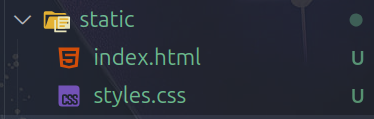
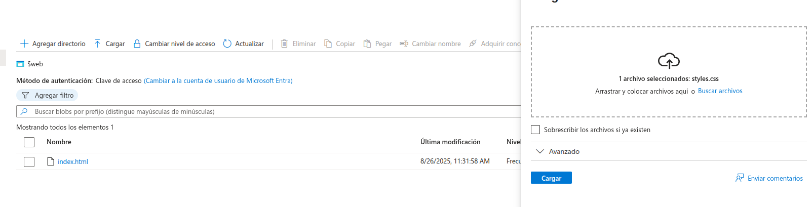
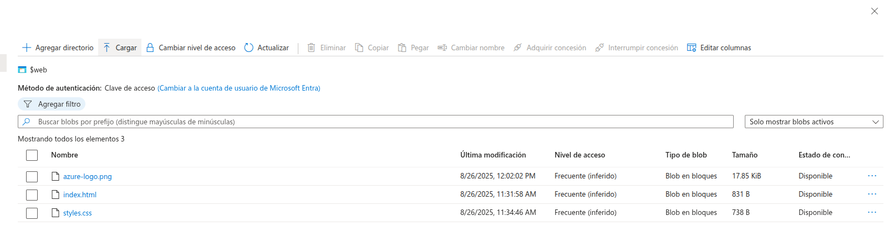
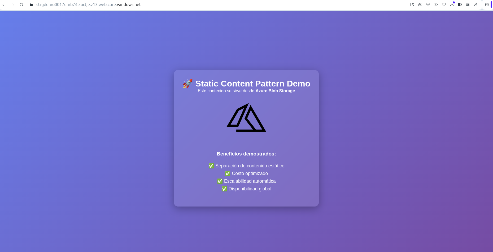

# Bitácora de Desarrollo (`dev-log.md`)

Este documento describe paso a paso el proceso de construcción del proyecto de arquitectura basada en STATIC CONTENT HOSTING.

---

### Creación y configuración de recursos

Primero, se creó el storage account

Habilitamos la opción de Static Web Site y configuramos el índice y la ruta de acceso del error

### Creación y carga de archivos estáticos

Generamos los archivos estáticos para subirlos al Storage Account

Ahora hay que subir los archivos estáticos al contenedor `web`

### Captura del funcionamiento

